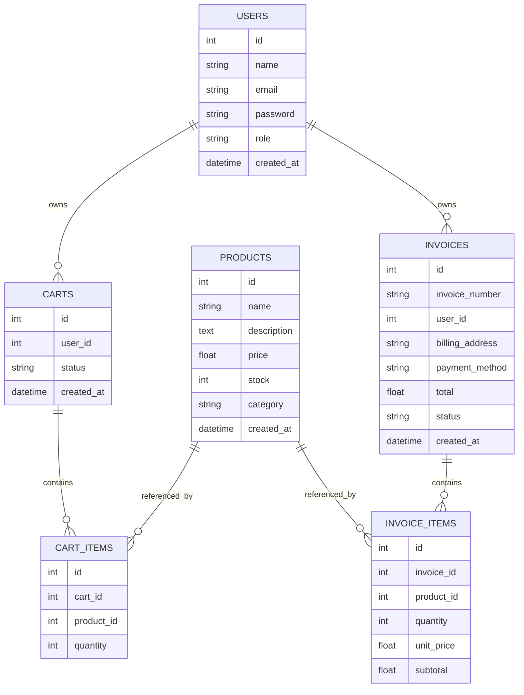

# Documentación de entrega

## 1. Propósito

Este documento describe la solución implementada, incluye el diagrama de la base de datos y las justificaciones técnicas principales. Está diseñado para entregar junto con el proyecto sin alterar el README principal.

## 2. Diagrama de base de datos



## 3. Justificaciones técnicas

### 3.1 Selección de tecnología
- **Flask** se eligió por ser un framework ligero y rápido de configurar para un backend de APIs.
- **SQLAlchemy** permite usar modelos relacionales y consultas claras sin escribir SQL explícito.
- **JWT** se empleó para la autenticación sin estado en el backend, lo que facilita proteger rutas y validar roles.

### 3.2 Cacheo
- Se aplicó cacheo en los endpoints de productos:
  - `GET /products/`
  - `GET /products/<id>`
- Estos endpoints son de lectura frecuente y normalmente son consultados muchas veces por el cliente.
- Redis reduce la carga sobre la base de datos y mejora el tiempo de respuesta.

### 3.3 TTL de cache
- El cache de productos utiliza un TTL de `60 segundos`.
- Esto mantiene un balance entre frescura de datos y rendimiento:
  - los cambios en el catálogo se reflejan con rapidez después de unos segundos,
  - mientras que las consultas repetidas aprovechan el cache.

### 3.4 Invalidación de cache
- Cuando se crea, actualiza o elimina un producto, se borra el cache de:
  - `products_all`
  - `product_<id>`
- De esta forma, las consultas posteriores recuperan datos actualizados.

### 3.5 Control de acceso y permisos
- Se usó un decorador de roles con JWT para permitir rutas solo a administradores.
- Las rutas de creación, edición y eliminación de productos, así como el refund de facturas, están protegidas para `admin`.
- El resto de rutas de usuario usan JWT normal para asegurar que el usuario esté autenticado.

### 3.6 Manejo de errores
- Se centralizó el manejo de errores con la clase `ApiError`.
- Las respuestas de error son uniformes:

```json
{
  "status": "error",
  "message": "Texto del error"
}
```

- Esto facilita pruebas y consumo de la API por parte del cliente.

### 3.7 Validación de datos
- La validación de entrada está en `services/validation.py`.
- Las solicitudes se validan antes de ejecutar la lógica de negocio, evitando errores por datos inválidos.

### 3.8 Flujos de carrito y facturación
- El carrito mantiene un estado `ACTIVE` mientras se está construyendo.
- Al hacer checkout, el carrito pasa a `COMPLETED` y se genera la factura.
- Esto evita facturas parciales o inconsistentes.

## 4. Pruebas y validación

- La solución fue probada con Postman para los flujos de registro, login, productos, carrito, checkout, facturas y refund.
- La suite de pruebas automatizadas se ejecuta con:

```bash
pytest -q
```

- Actualmente la suite pasa con `41 tests`.
